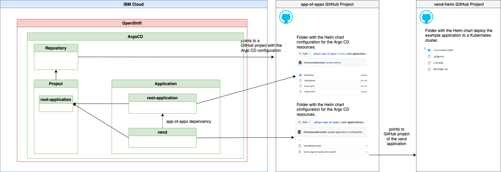

# gitops-app-of-apps

This is an example to setup an [app-of-apps pattern in ArgoCD](https://argo-cd.readthedocs.io/en/stable/operator-manual/cluster-bootstrapping/).

The readme is organized in th following sections:

1. Simplified architecture overview
2. Understand the `"app-of-apps"` Argo CD configuration for the example
2. Deploy the are following:

## 1. Simplified architecture overview

That is a simplified architecture overview



As a starting point we are using the which can be created by following the blog post called ["Use Software Everywhere and IasCable to setup GitOps on a Red Hat OpenShift Cluster in a Virtual Private Cloud on IBM Cloud"](https://wp.me/paelj4-1tZ), please at the this blog post for details. 

Our starting point:

* IBM Cloud is used
* Red Hat OpenShift in a VPC is setup
* Argo CD is setup and initial bootstap configured

And we are going to use ...

* ... two existing GitHub repositories:

    * One GitHub repository for the Argo CD configurations
    * One GitHub repository for the example application called vend

* ... Helm to the `app-of-apps` the `vend example` application to our cluster

    The images shows create Argo CD resoucres later.
    

* ... folder `"root-applications"` contains the CD configuration yaml for new applications. In our case we have saved the application configuration for the `example vend app` in the `"root-applications"` folder.

In current example we won't use the [pre-configured bootstap resoures](https://github.com/cloud-native-toolkit/terraform-tools-gitops) for Argo CD resources, created by the [Software Everywhere](https://github.com/cloud-native-toolkit/software-everywhere) module called [terraform-tools-gitops](https://github.com/cloud-native-toolkit/terraform-tools-gitops).

## 2. Understand the `"app-of-apps"` Argo CD configuration for the example

### a) Repository

```yaml
apiVersion: v1
kind: Secret
metadata:
  name: {{ .Values.repository_metadata_name }}
  namespace: {{ .Values.repository_metadata_namespace }}
  labels:
    argocd.argoproj.io/secret-type: repository
stringData:
  type: git
  url: {{ .Values.repository_stringData_url }}
```

Relevant values for the repository in the Helm `values.yaml` file.

```yaml
repository_metadata_name:  "github.com-thomassuedbroecker-gitops-app-of-apps"
repository_metadata_namespace: "openshift-gitops"
repository_stringData_url: "https://github.com/thomassuedbroecker/gitops-app-of-apps"
```

### b) Project

```yaml
apiVersion: argoproj.io/v1alpha1
kind: AppProject
metadata:
  name: {{ .Values.project_metadata_name }}
  namespace: {{ .Values.project_metadata_namespace }}
spec:
  clusterResourceWhitelist:
    - group: '*'
      kind: '*'
  description: This is just an root-project example.
  destinations:
    - name: {{ .Values.project_destination_name }}
      namespace: '*'
      server: {{ .Values.project_destination_server }}
  namespaceResourceWhitelist:
    - group: '*'
      kind: '*'
  sourceRepos:
    - '*'
status: {}
```

Relevant values for the repository in the Helm `values.yaml` file.

Let us have a short look at some of the values:

1. `project_destination_namespace`: Here we reuse the exising `"openshift-gitops"` namespace.
2. `project_destination_namespace`: We allow all namespases `"*"` as destination namespaces.
3. `project_destination_name`: We configure only `"in-custer"` as a valid cluser
4. `project_source_repo_url`: We configure our repository, where we are going to search for new applications to deploy.

```yaml
project_metadata_name:  "root-application"
project_metadata_namespace: "openshift-gitops"
project_destination_namespace: "*"
project_destination_name: "in-cluster"
project_destination_server: "https://kubernetes.default.svc"
project_source_repo_url: "https://github.com/thomassuedbroecker/gitops-app-of-apps"
```

### b) `app-of-apps` Application 

This is the `app-of-apps` application configuration.We call the configuration in our situation the application `root-application`.

The image below shows a later stage, when we sync all resources.


```yaml
apiVersion: argoproj.io/v1alpha1
kind: Application
metadata:
  name: {{ .Values.application_metadata_name }}
  namespace: {{ .Values.application_metadata_namespace }}
spec:
  destination:
    name: {{ .Values.application_destination_name }}
    namespace: {{ .Values.application_destination_namespace }}
  project: {{ .Values.application_project }}
  source:
    path: {{ .Values.application_source_path }} 
    repoURL: {{ .Values.application_source_repo_url }}
    targetRevision: HEAD
  syncPolicy:
    retry:
      backoff:
        duration: 5s
        factor: 2
        maxDuration: 3m0s
      limit: 2
```

```yaml
application_metadata_name:  "root-application"
application_metadata_namespace: "openshift-gitops"
application_destination_namespace: "openshift-gitops"
application_destination_name: "in-cluster"
application_project: "root-application"
application_source_repo_url: "https://github.com/thomassuedbroecker/gitops-app-of-apps"
application_source_path: "root-applications"
```


## Steps 1: Apply an `Argo CD` configure to use own `app of apps` configuration by using helm

First we will deploy the Argo CD `root-application` with the related project and repository to `Argo CD`.

* Update Helm dependencies

```sh
helm dependency update ./root-application
```

* Verify Helm configuration

```sh
helm lint
helm install --dry-run --debug root-application ./root-application/
```

* Install Argo CD configuration using Helm

```sh
helm install root-application ./root-application/
```

* Uninstall Argo CD configuration using Helm

```sh
helm uninstall root-application
```

>Note: When we create the repository with Helm we don't have the access rights to connect to the github repository we are using as our repository. That why we need to recreate it later from the ui, because we in that example we what to use public github project and we don't save credenticals in a public github project. 

## Step 2: Understand the Argo CD configuration


